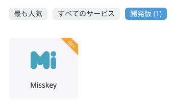
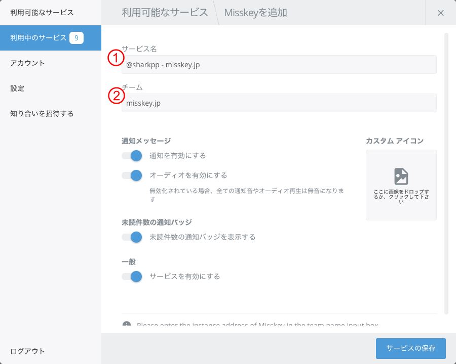
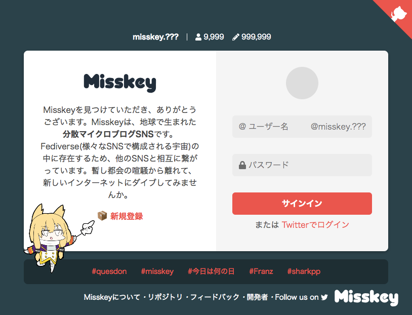

# Misskey for Franz 5

This is the [Franz](https://meetfranz.com/) 5 recipe for Misskey

## REQUIRED

* [Franz](https://meetfranz.com/) 5 or later
  Do not support older version.
* [Misskey](https://joinmisskey.github.io/) account
  Do not have an account?
  Choose from "[Misskey instances](https://joinmisskey.github.io/ja/wiki/instances/#others)"!

## HOW TO INSTALL

### DEVELOP VERSION

1. download the `franz-recipe-misskey` folder.
2. Open the Franz Plugins folder on your machine (note **that this `dev` directory may not exist yet, and you must create it**):
  * Mac: `~/Library/Application Support/Franz/recipes/dev/`
  * Windows: `%AppData%\Franz\recipes\dev\`
  * Linux: `~/.config/Franz/recipes/dev`
3. Copy the `franz-recipe-misskey` folder into the plugins directory
4. Reload Franz

See [Franz Recipe Documentation / Overview](https://github.com/meetfranz/plugins/blob/master/docs/integration.md)
 for details.

### STABLE VERSION

*Coming Soon ...*

## USAGE

### ADD NEW SERVICE

*develop version*

### SETTINGS

| # | field | description |
|-|-|-|
| (1) | service name | Please set freely |
| (2) | Misskey host | Please enter the host on which Misskey is running. Only https is supported. |

### SIGN-IN

Please enter registered account information.

### NOTIFICATION BADGE

In order to use it, desktop notification must be enabled on *misskey* side.

| current actived service | clear badge |
|-|-|
| this service | At the end of 10 seconds from the last notice | 
| other service | this service actived |

## LICENSE

&copy; 2018 sharkpp

This software is licensed under a [The MIT License](http://opensource.org/licenses/MIT).
